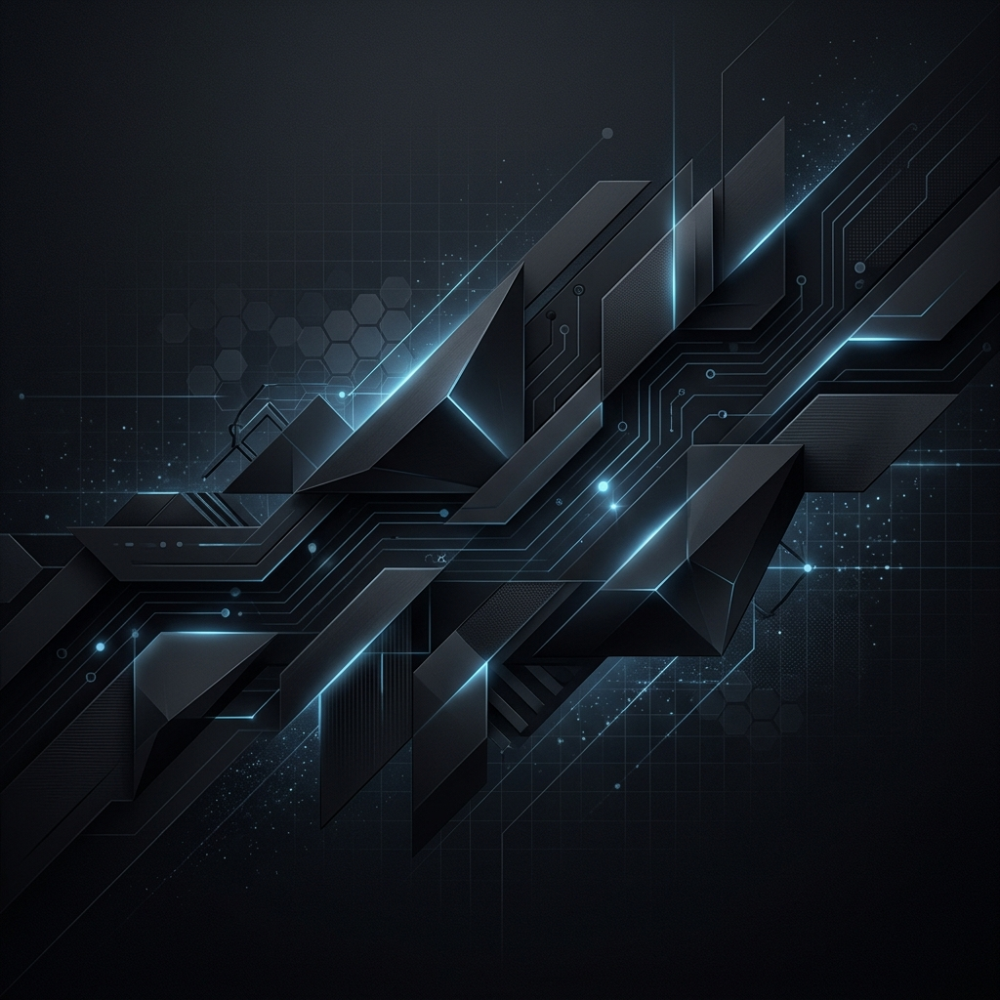
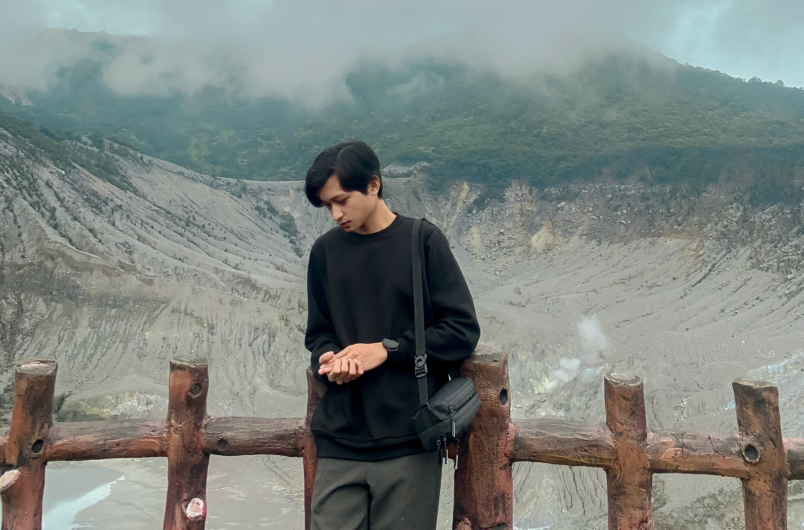
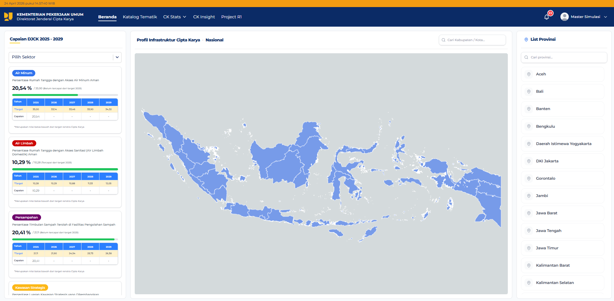

# 🚀 Modern Senior-Level Portfolio



<div align="center">
  <h3>
    <a href="https://renaldi-mohamad.vercel.app">Live Demo</a>
    <span> | </span>
    <a href="#-tech-stack">Tech Stack</a>
    <span> | </span>
    <a href="#-features">Features</a>
    <span> | </span>
    <a href="#-getting-started">Getting Started</a>
  </h3>
</div>

---

## 🌟 Overview

Welcome to my professional portfolio! This project is a **production-grade, senior-level personal website** built with the latest technologies to showcase my journey, projects, and technical expertise. Designed with a focus on minimalism, performance, and premium user experience.

> [!NOTE]
> This portfolio is built with **Next.js 14**, **TypeScript**, and **Tailwind CSS**, featuring a fully responsive design and professional-grade animations.

---

## 🛠 Tech Stack

| Category | Technologies |
| :--- | :--- |
| **Core** |    |
| **Styling** |   |
| **Backend/Tools** |   |
| **Deployment** |  |

---

## ✨ Features

- 🌓 **Dynamic Theme**: Persistent Dark and Light modes with smooth transitions.
- 📱 **Fully Responsive**: Optimized for all devices, from mobile to ultra-wide monitors.
- 🎬 **Premium Animations**: Integrated with Framer Motion for a fluid, professional feel.
- ⚡ **Performance Optimized**: Built for speed with a near-perfect Lighthouse score.
- 📧 **Functional Contact Form**: Integrated with Resend SDK for seamless communication.
- 🔍 **SEO Ready**: Proper semantic HTML, metadata, and accessible structure.

---

## 📸 Preview

<div align="center">
  
  
</div>

---

## 📂 Project Structure

```bash
portfolio-aldi/
├── app/              # Next.js App Router (Pages & Layouts)
├── components/       # Reusable UI components & Sections
│   ├── ui/           # Base UI elements (Shadcn-like)
│   └── sections/     # Main page sections (Hero, About, etc.)
├── public/           # Static assets (Images, Icons)
├── lib/              # Utility functions and shared logic
└── tailwind.config.ts # Custom design system & theme
```

---

## 🚀 Getting Started

### Prerequisites

- Node.js 18.x or later
- npm or yarn

### Installation

1. **Clone the repository**
   ```bash
   git clone https://github.com/renaldimohamad/portfolio-aldi.git
   cd portfolio-aldi
   ```

2. **Install dependencies**
   ```bash
   npm install
   ```

3. **Set up Environment Variables**
   Create a `.env.local` file and add your Resend API key:
   ```env
   RESEND_API_KEY=re_your_api_key
   ```

4. **Run the development server**
   ```bash
   npm run dev
   ```
   Open [http://localhost:3000](http://localhost:3000) in your browser.

---

## 👤 Author

**Renaldi Mohamad**
- GitHub: [@renaldimohamad](https://github.com/renaldimohamad)
- LinkedIn: [Renaldi Mohamad](https://linkedin.com/in/renaldimohamad)

---

## 📄 License

This project is licensed under the MIT License.

---

<div align="center">
  <sub>Built with ❤️ by Renaldi Mohamad</sub>
</div>
